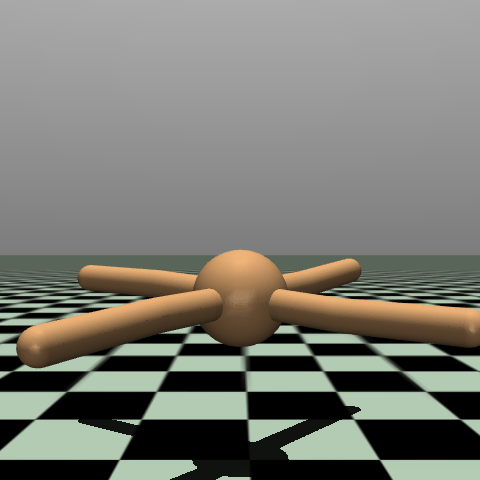
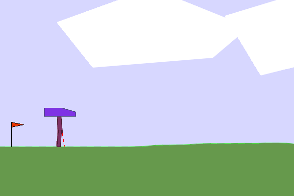
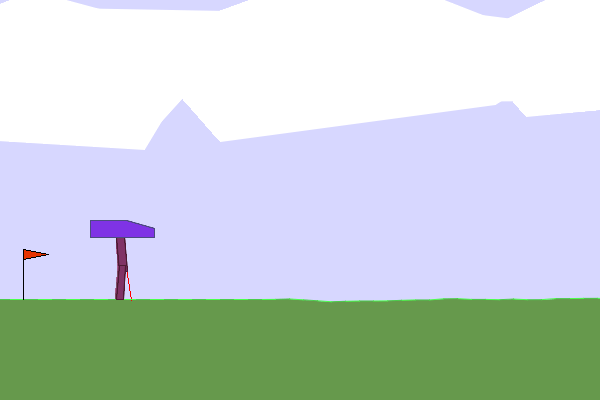
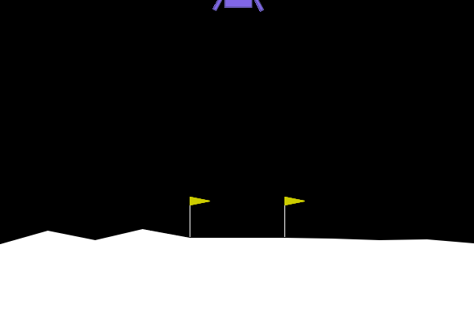
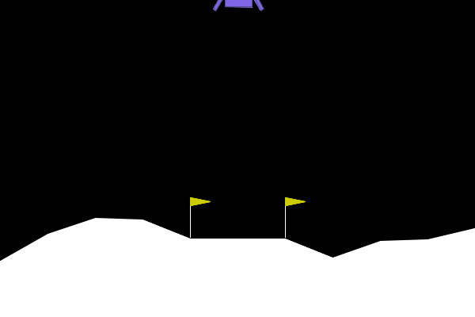
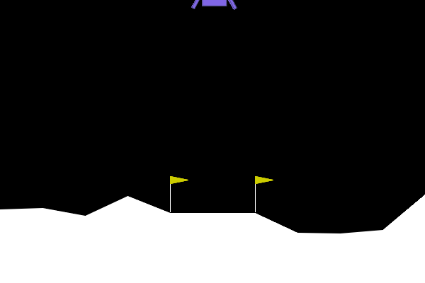
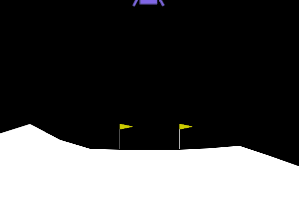
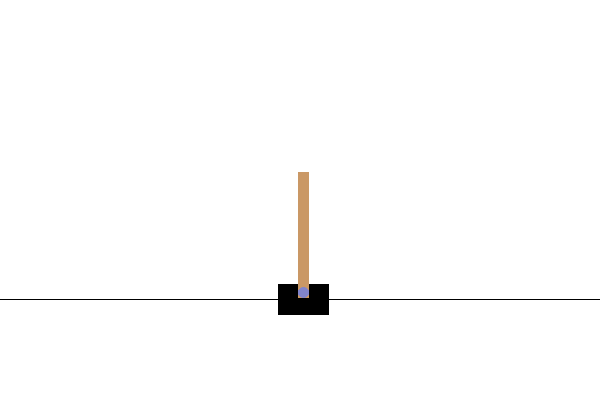
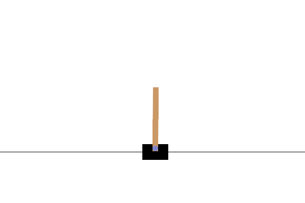

# Extending the applicability of world modeling with DreamerX


**DreamerX** is an implementation of model-based DreamerV3 with additions for transformer-based observation encoding and decoding, novel training adjustments and discretization strategies, and minor optimizations. DreamerX learns a compact latent representation of environment dynamics and estimates transitions based on sequential actions. This is known as the world model. Then, the actor-critic trains exclusively on *imagined* latent states from the world model, allowing learning using inferred dynamics through backpropagation using the world model weights.

The library is designed to be *flexible* and *user-friendly*, allowing researchers and practitioners to easily swap in custom environments, architectural variants, or benchmark new implementations against a validated baseline. DreamerX has been tested using [Gymnasium](https://gymnasium.farama.org/) and [MuJoCo](https://gymnasium.farama.org/environments/mujoco/) environments, is currently being tested using [RLGym](https://rlgym.org/), and is constantly expanding to include more environments and techniques. Please check out the [documentation](https://oafish1.github.io/DreamerX/) to get started.

> [!NOTE]
> This repository is in active development. Please check back later for more information, features, and examples.

## Features

- **Explainable Code**: The flow, sections, and logic of the training process and individual components are well-documented with references to relevant source material.
- **Modular Design**: Model components, distributions, and losses are easily interchangable with easy-to-understand and documented interfaces for custom implementations.
- **Transformer Encoder-Decoder**: Transformer-based attention encoders and decoders are used to allow for variable-length observations
- **Novel Optimizations**: Minor optimizations and novel discretization strategies, including two hot discretization, are available, with more coming soon.
- **Detailed Logging**: Logging, checkpointing, and evaluation are available out of the box with [pre-assembled configuration files](./examples/configs/) readily available.
- **Gymnasium API Support**: DreamerX is broadly applicable to environments complying to the Gymnasium API, with optional rendering support.

## Trained examples

<table>
    <tbody>
        <!-- RLGym Soccar -->
        <!-- <tr bgcolor="#2b2b68">
            <td colspan=4 style="text-align: center"><b>MuJoCo Walker2d-v5</b></td>
        </tr>
        <tr>
            <td style="text-align: center">100K Steps</td>
            <td style="text-align: center">200K Steps</td>
            <td style="text-align: center">500K Steps</td>
            <td style="text-align: center">1M Steps</td>
        </tr>
        <tr>
            <td style="text-align: center">
                <video controls width="100%" alt="Trained Dreamer-V3 agent after 100k steps on RLGym Soccar environment">
                <source src="./examples/images/RLGym_10k.mp4" type="video/mp4">
            </td>
            <td style="text-align: center">
                <video controls width="100%" alt="Trained Dreamer-V3 agent after 200k steps on RLGym Soccar environment">
                <source src="./examples/images/RLGym_10k.mp4" type="video/mp4">
            </td>
            <td style="text-align: center">
                <video controls width="100%" alt="Trained Dreamer-V3 agent after 500k steps on RLGym Soccar environment">
                <source src="./examples/images/RLGym_10k.mp4" type="video/mp4">
            </td>
            <td style="text-align: center">
                <video controls width="100%" alt="Trained Dreamer-V3 agent after 1m steps on RLGym Soccar environment">
                <source src="./examples/images/RLGym_10k.mp4" type="video/mp4">
            </td>
        </tr> -->
        <!-- Walker2D -->
        <tr bgcolor="#2b2b68">
            <td colspan=4 style="text-align: center"><b>MuJoCo Walker2d-v5</b></td>
        </tr>
        <tr>
            <td style="text-align: center">100K Steps</td>
            <td style="text-align: center">200K Steps</td>
            <td style="text-align: center">500K Steps</td>
            <td style="text-align: center">1M Steps</td>
        </tr>
        <tr>
            <td style="text-align: center"></td>
            <td style="text-align: center"></td>
            <td style="text-align: center"></td>
            <td style="text-align: center"></td>
        </tr>
        <!-- Ant -->
        <tr bgcolor="#2b2b68">
            <td colspan=4 style="text-align: center"><b>MuJoCo Ant-v5</b></td>
        </tr>
        <tr>
            <td style="text-align: center">10K Steps</td>
            <td style="text-align: center">50K Steps</td>
            <td style="text-align: center">100K Steps</td>
            <td style="text-align: center">200K Steps</td>
        </tr>
        <tr>
            <td style="text-align: center"></td>
            <td style="text-align: center"></td>
            <td style="text-align: center"></td>
            <td style="text-align: center"></td>
        </tr>
        <!-- Hopper -->
        <tr bgcolor="#2b2b68">
            <td colspan=4 style="text-align: center"><b>MuJoCo Hopper-v5</b></td>
        </tr>
        <tr>
            <td style="text-align: center">10K Steps</td>
            <td style="text-align: center">20K Steps</td>
            <td style="text-align: center">30K Steps</td>
            <td style="text-align: center">40K Steps</td>
        </tr>
        <tr>
            <td style="text-align: center"></td>
            <td style="text-align: center"></td>
            <td style="text-align: center"></td>
            <td style="text-align: center"></td>
        </tr>
        <!-- BipedalWalker -->
        <tr bgcolor="#2b2b68">
            <td colspan=4 style="text-align: center"><b>BipedalWalker-v3</b></td>
        </tr>
        <tr>
            <td style="text-align: center">10K Steps</td>
            <td style="text-align: center">50K Steps</td>
            <td style="text-align: center">100K Steps</td>
            <td style="text-align: center">200K Steps</td>
        </tr>
        <tr>
            <td style="text-align: center"></td>
            <td style="text-align: center"></td>
            <td style="text-align: center"></td>
            <td style="text-align: center"></td>
        </tr>
        <!-- LunarLander -->
        <tr bgcolor="#2b2b68">
            <td colspan=4 style="text-align: center"><b>LunarLander-v3</b></td>
        </tr>
        <tr>
            <td style="text-align: center">1K Steps</td>
            <td style="text-align: center">10K Steps</td>
            <td style="text-align: center">25K Steps</td>
            <td style="text-align: center">50K Steps</td>
        </tr>
        <tr>
            <td style="text-align: center"></td>
            <td style="text-align: center"></td>
            <td style="text-align: center"></td>
            <td style="text-align: center"></td>
        </tr>
        <!-- Reacher -->
        <!-- <tr bgcolor="#2b2b68">
            <td colspan=4 style="text-align: center"><b>MuJoCo Reacher-v5</b></td>
        </tr>
        <tr>
            <td style="text-align: center">20K Steps</td>
            <td style="text-align: center">50K Steps</td>
            <td style="text-align: center">100K Steps</td>
            <td style="text-align: center">200K Steps</td>
        </tr>
        <tr>
            <td style="text-align: center"></td>
            <td style="text-align: center"></td>
            <td style="text-align: center"></td>
            <td style="text-align: center"></td>
        </tr> -->
        <!-- CartPole -->
        <!-- <tr bgcolor="#2b2b68">
            <td colspan=4 style="text-align: center"><b>CartPole-v1</b></td>
        </tr>
        <tr>
            <td style="text-align: center">1K Steps</td>
            <td style="text-align: center">8K Steps</td>
            <td style="text-align: center">15K Steps</td>
            <td style="text-align: center">26K Steps</td>
        </tr>
        <tr>
            <td style="text-align: center"></td>
            <td style="text-align: center"></td>
            <td style="text-align: center"></td>
            <td style="text-align: center"></td>
        </tr> -->
    </tbody>
</table>

<!-- | CartPole | LunarLander |
| :---: | :---: |
|  |  | -->

## Installation

To install the library, first clone the repository
```bash
git clone https://github.com/Oafish1/DreamerX
cd DreamerX
```

Then, install DreamerX and dependencies
```bash
make install  # Only install necessary libraries, equivalent to `pip install -e .`
make install-dev  # Also install optional libraries, equivalent to `pip install -e .[dev,gym,extras]`
```

## Usage


Please see the [`Dreamer` notebook](./examples/Dreamer.ipynb) in the examples folder for usage examples. A quick-start tutorial will be available shortly. In the meantime, please refer to the [documentation](https://oafish1.github.io/DreamerX/) and don't hesitate to post an issue if you have any questions or concerns.
